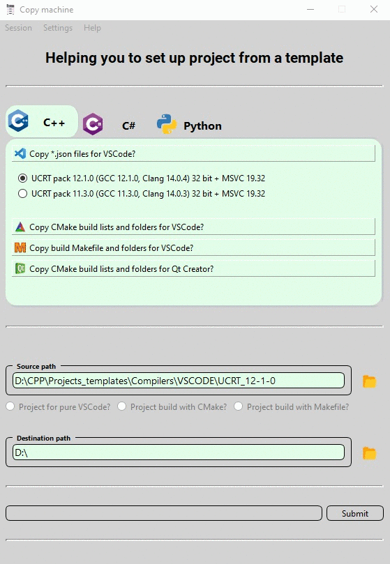
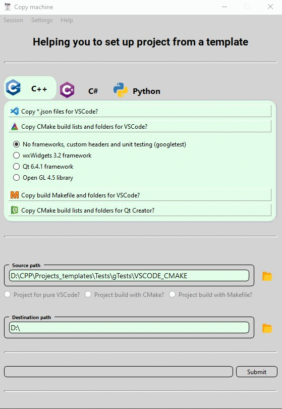

# Settings copying machine

A GUI application that helps users to copy preferable settings of project setup.
The back-end of the application is written in C++, and front-end is written with help of the Qt framework.
Users need to choose a folder with needed settings and they would be copied to some other destination.

<<<<<<< HEAD

When copy process is finished user will receive appropriate message:

=======

When copy process is finished user will receive appropriate message:

>>>>>>> 0a5e86fc9536a1372801da8afd7db9ff3f068019
